# Movidius Performance

## Executive summary

The given research mission is a continuation of our [FPGA research](README.md), aimed on evaluation of Movidius Stick performance capabilities.
Training and run of neural network usually is performed using GPU accelerators.
For power- and space-restricted environment, usage of FPGA or specialized chips like Intel Nervana instead of GPU could be more efficient. 
Intel proposes Movidius Neural Compute Stick, based on Myriad 2 family of vision processing units (VPUs), as transitional solution for low power embedded systems and systems without GPU.
Areas of application of the stick - development of drones, robotics, security, virtual and augmented reality. 
It can plug into any device that has a USB port to roll out machine learning features.

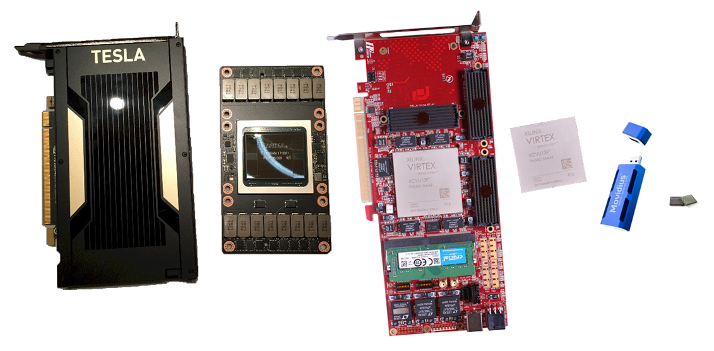

The Chip itself contain 12 VLIW "SHAVE" processors (SHAVE - Streaming Hybrid Architecture Vector Engine) and
has an USB interface for communication with the host. Neural Computing Stick SDK includes tools to compile Caffe and TensorFlow network descriptions into blob objects 
and communication API (Python, C++), allowing to load it to Movidius stick as well as writing/reading the input/output data.

It is obvious, that Movidius performance (in terms of images processed per second) depends from number of SHAVE processors used.
Our research demonstrates, that 12 SHAVEs performance is 2-4x better compared to single SHAVE one.
From other side, single SHAVE uses 1.6-2.3x less power compared to full 12 SHAVEs load.
Usage of 4, 8 or 12 SHAVES for billion of images processing provides similar results and are the most effective in terms of costs.
Besides, Movidius provides better results in terms of performance per watt compared to GPU and FPGA. 
Movidius stick is heating during the usage - about 30°C for 1 SHAVE usage or 40°C 12 SHAVEs usage. 

## Experiment design

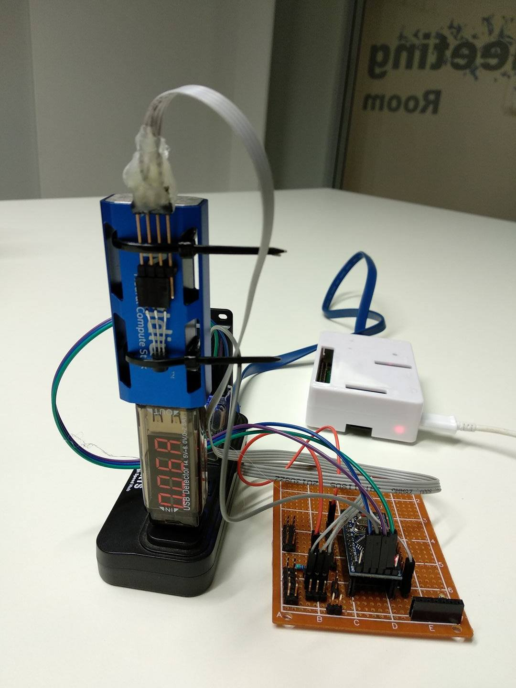

### Performance measuring
  
For chip performance measurement, we used Caffe implementation of AlexNet, GoogLeNet and SqueezeNet. 
Networks were compiled to use 1,2,4,8 or 12 Movidius SHAVE processors and loaded into the stick.
Test image was loaded to the stick for recognition, measurings of image processing and loading time.
20 test images were used for experiment with 1000 cycles run for data collection.

### Power consumption

We used XTARs USB Detector to measure power consumption during computations.
Same experiments as for performance measuring with 100 cycles run performed for data collection.

### Heating measurements

Temperature sensor was placed on Movidius surface to measure the heating.
Measurements were performed only for one Network (AlexNet), for 1 SHAVE and 12 SHAVE processors, used for calculations, because of low temperature changes.
Experiment was repeated 1000 times. Movidius stick surface temperature values were recorded after each 100 repetitions.

## Results of measurement

Processed images per second vs number of SHAVE processors used.

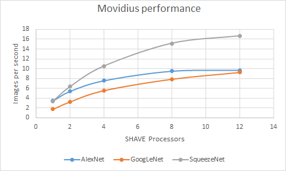

Power consumption.

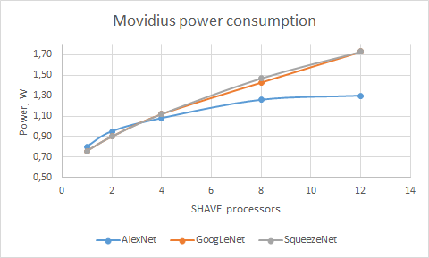

Images per dollar vs number of SHAVE processors. 
During calculations we assume that average costs of electricity in US is about 12 cents per kilowatt-hour (https://www.npr.org/sections/money/2011/10/27/141766341/the-price-of-electricity-in-your-state).

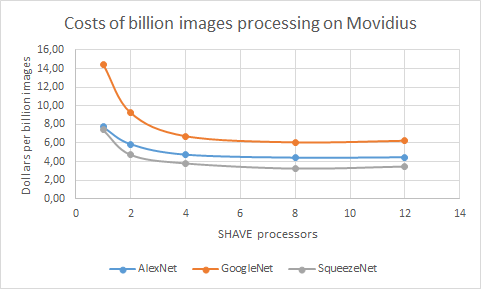

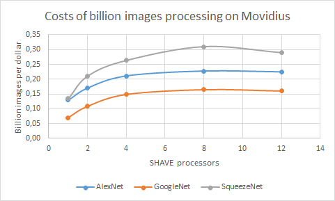

Results of Movidius stick heating. After some unstable period, temperature was stabilized to 32°C or 37°C.

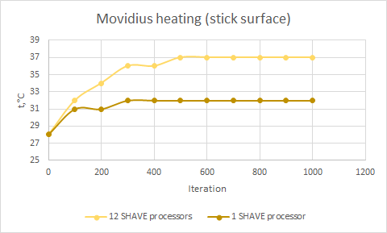

Also we used results from previous article ([FPGA research](README.md)) and calculated performance per watt compared to GPU and FPGA. 

 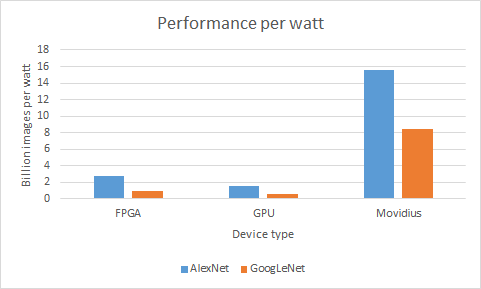 
 
Movidius won in that category. So we recommend usage of that stick in low power consumption devices (sensors, drones, cameras).

Author: Andriy Bench  

## Appendix. Detailed results of performance measuring.

| Network    | Overall process           | Image loading    | Image processing        | 
| --------- -| ------------------------- | -----------------| ------------------------| 
| AlexNet    | 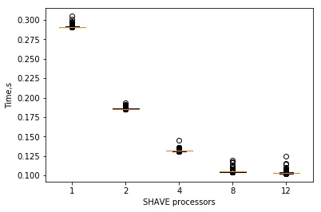 | 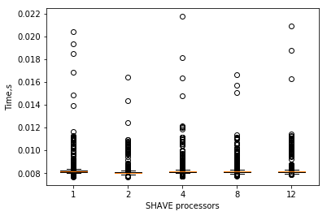 | 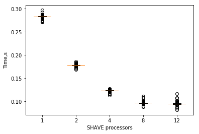 |
| GoogLeNet  | 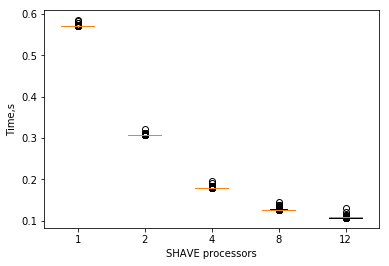 | 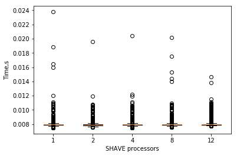 | 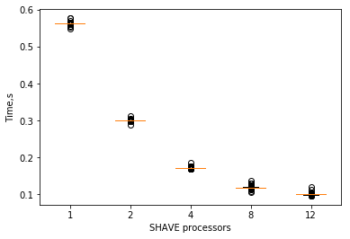 |
| SqueezeNet | 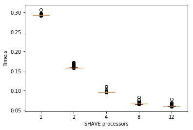 | 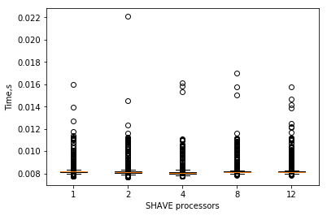 | 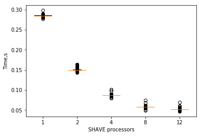 |   

    
