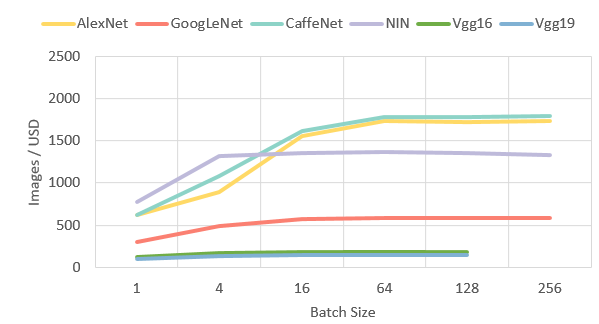

# FPGA-based Machine Learning Acceleration

We are between 3 and 4 stages of [IoT technology roadmap](https://en.wikipedia.org/wiki/Internet_of_things#/media/File:Internet_of_Things.svg). Current stage is miniaturization  - building energy efficient electronics and software agents and advanced sensor fusion, allowing multiple interconnected objects to behave as single machine. Computing is shifting to the edge of the [IoT network](http://cdn.iotwf.com/resources/72/IoT_Reference_Model_04_June_2014.pdf) mainly because of data gravity (pace of bandwidth growth lags behind pace of data creation). Other factors are privacy (nobody wants to send over insecure network), latency, reliability (make life vs death decisions in-destination, in autonomous cars). To make small IoT agents smarter, they need to do more computing, and energy efficiency is  crucial success factor. 

Besides energy efficiency, there is devices smartness. We electrified things, then digitized things, and now cognify things. Speech recognition, real-time translation, object identification, emotion recognition is now available on smartphones and evem smaller devices. The majority of these algorithms today are driven by Deep Learning, machine learning inspired by neuroscience, made possible due to computation capacities and big data. Move of these algorithms from data centers to small intelligent “things” is not straightforward. In some cases small reduce of accuracy is possible with huge saving in performance, with use of smaller networks, sparse, ternary or binary networks and integer (or sub-integer) data types instead of floats.

Burning software bits into silicon hardware is the way to achieve energy and space efficiency. We believe that FPGA is the “next big thing” in AI hardware and custom FPGA and ASIC chips will transform data centers from one side, and small “thins” or devices from other. Data center performance per watt and performance per dollar matters. Ultimate flexibility of FPGA chips allows dynamic reconfiguration (optimization) of hardware for specific task. 

Artificial Intelligence (AI) is growing. AI is becoming new programing paradigm. We [computer scientists and software engineers] approach AI in form of Machine Learning (ML) and particularly Deep Learning. Modern machine learning achievements are possible due to data and computing power, which were not available 10 years ago. The need of computing is growing faster than computing capacity of general purpose hw (processors and coprocessors). With growing complexity of ML algorithms, and data amounts, hardware acceleration is still important. 

## Hardware Accelerators
While GPU acceleration (lead by NVidia) is de-facto standard in today’s mainstream deep learning, other acceleration technologies emerge.

Titan X, Most popular GPU used for Deep Learning today. Source: nvidia.com

In mid-2016 Google [announced TPU](https://cloudplatform.googleblog.com/2016/05/Google-supercharges-machine-learning-tasks-with-custom-chip.html), custom ASIC designed for machine learning, claiming over 90 TOPS of INT8 on 75W chip, which is 15x inference performance and 29x performance/watt over K80 (comparable chip model from NVidia at that time). Second generation of TPU can provide 180 TFLOPS on 4-chip board.

Google Second-gen TPU. Source: cloud.google.com

Intel, leader (>99%) in server computing power also entered the game of ML acceleration, first with [Intel Arria](https://www.altera.com/products/boards_and_kits/dev-kits/altera/acceleration-card-arria-10-gx.html), FPGA co-processor, and then with Intel® Xeon® Processor with integrated FPGA. 

Intel Arria 10 GX FPGA Development Kit. Source: altera.com

Xilinx, the market leader in FPGA, in 2017 became available to consumers also through Amazon cloud, as f1 instance.

XUPP3R PCIe board based on a Xilinx Virtex UltraScale+ XCVU9P FPGA.  Source: forums.xilinx.com

Today, few dozens of startups are building custom chips for hardware AI acceleration, such as Graphcore, Mythic, Intel Nervana.

## The Benchmarking Experiment

We measured performance per dollar of GPU and FPGA hardware using Amazon AWS EC2 instances.  Use of AWS instances allows fair benchmarking of performance per dollar as cost is precisely computed with use of instance price. Performance per watt cannot be measured on AWS, as it requires physical bare-metal setup. 

The test benchmark is based on Caffe ImageNet image classification using 6 winning neural network architectures (AlexNet, GoogLeNet, CaffeNet, NIN, Vgg16, Vgg19). Test bench is based on AMI Deep Learning Zebra Deep-Learning engine for Caffe (1 FPGA) [by Mipsology](https://aws.amazon.com/marketplace/pp/B073SHB43M)

For the benchmark, unmodified DNN and Caffe were used (based on float64). It is expected that with lower-precision and sparse DNN could [dramatically change](https://www.nextplatform.com/2017/03/21/can-fpgas-beat-gpus-accelerating-next-generation-deep-learning/) the results towards better results for FPGA. 

As FPGA instance we used f1.2xlarge as the comparable instance type to GPU p2. F1 instance is based on Xilinx UltraScale+ VU9 on AWS, cost is $1.65 per Hour. Xilinx UltraScale+ VU9 is based on 16nm process, with local 64 GiB DDR4 ECC protected memory, with a dedicated PCI-e x16 connection to the instance.  Each FPGA contains approximately 2.5 million logic elements and approximately 6,800 Digital Signal Processing (DSP) engines.  

FPGA performance, Images / USD. Some results are missing due to not enough memory.
